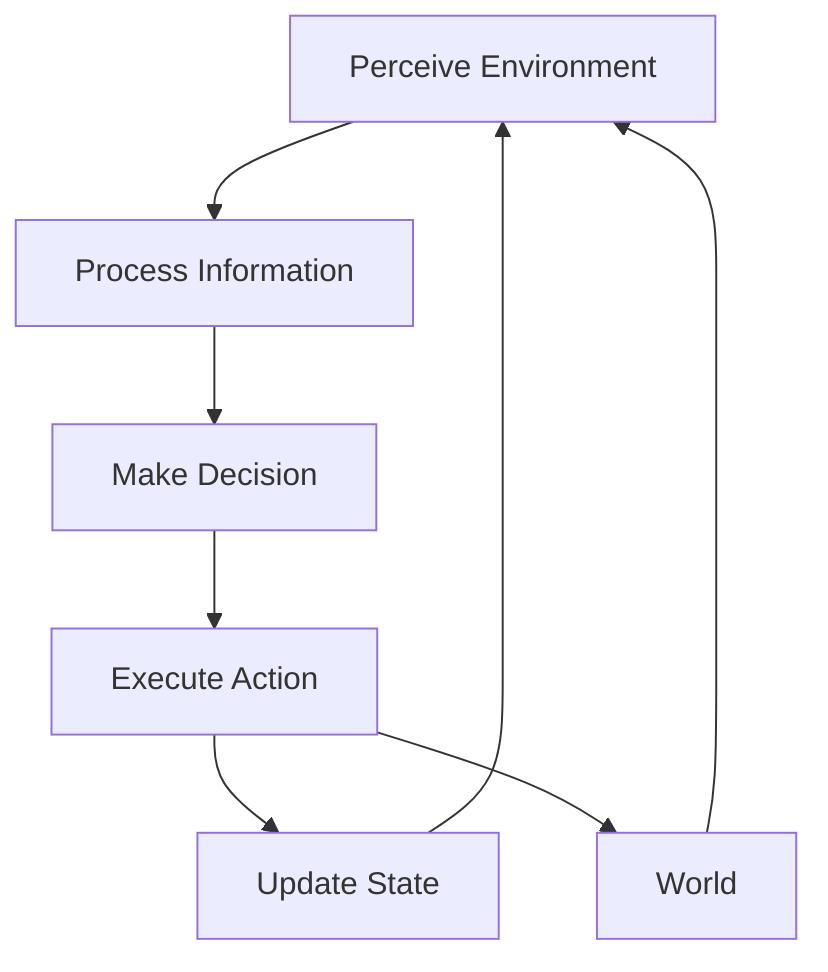

# Chapter 1: Introduction to Physical AI

## Learning Objectives

By the end of this chapter, you will understand:
- What Physical AI is and why it matters
- The fundamental components of Physical AI systems
- How AI interacts with the physical world
- Key applications in robotics and autonomous systems

## 1.1 What is Physical AI?

Physical AI refers to artificial intelligence systems that directly interact with and manipulate the physical world. Unlike traditional AI that exists purely in digital spaces, Physical AI bridges the gap between computational intelligence and physical action.

### Core Definition

**Physical AI** = **Artificial Intelligence** + **Robotics** + **Sensing** + **Actuation**

This integration enables machines to:
- Perceive their environment through sensors
- Make intelligent decisions based on perception
- Act on the physical world through actuators
- Learn from physical interactions

### Comparison with Traditional AI

| Aspect | Traditional AI | Physical AI |
|--------|----------------|-------------|
| Domain | Purely digital | Digital + Physical |
| Interaction | Data/software only | Real-world objects |
| Sensors | Not required | Essential |
| Actuators | Not required | Essential |
| Safety Concerns | Data privacy | Physical safety |
| Real-time Constraints | Often flexible | Often critical |

## 1.2 Why Physical AI Matters

### Revolutionizing Industries

1. **Manufacturing**
   - Adaptive production lines
   - Quality control with computer vision
   - Collaborative robots (cobots)

2. **Healthcare**
   - Surgical robots
   - Rehabilitation devices
   - Elder care assistance

3. **Transportation**
   - Autonomous vehicles
   - Traffic management
   - Last-mile delivery

4. **Agriculture**
   - Precision farming
   - Automated harvesting
   - Crop monitoring

### Societal Impact

- **Economic**: Increased productivity and new job categories
- **Social**: Enhanced quality of life and accessibility
- **Environmental**: Optimized resource usage
- **Ethical**: New considerations for human-AI interaction

## 1.3 Components of Physical AI Systems

### 1.3.1 Perception System

The perception system enables machines to understand their environment:

```python
# Example: Computer Vision for Object Detection
import cv2
import numpy as np

class PerceptionSystem:
    def __init__(self):
        self.camera = cv2.VideoCapture(0)

    def detect_objects(self, frame):
        """Detect objects in the camera frame"""
        # Convert to grayscale
        gray = cv2.cvtColor(frame, cv2.COLOR_BGR2GRAY)

        # Apply edge detection
        edges = cv2.Canny(gray, 50, 150)

        # Find contours
        contours, _ = cv2.findContours(
            edges, cv2.RETR_EXTERNAL, cv2.CHAIN_APPROX_SIMPLE
        )

        return contours
```

### 1.3.2 Decision System

The decision system processes perception data and determines actions:

```python
class DecisionSystem:
    def __init__(self):
        self.rules = {
            'obstacle_ahead': 'stop',
            'path_clear': 'move_forward',
            'target_detected': 'approach'
        }

    def make_decision(self, perception_data):
        """Make decision based on perception"""
        if perception_data.get('obstacle_distance', 100) < 20:
            return self.rules['obstacle_ahead']
        elif perception_data.get('target_found'):
            return self.rules['target_detected']
        else:
            return self.rules['path_clear']
```

### 1.3.3 Actuation System

The actuation system executes physical actions:

```python
class ActuationSystem:
    def __init__(self):
        self.motors = {
            'left': Motor(1),
            'right': Motor(2)
        }

    def execute_action(self, action):
        """Execute physical action"""
        if action == 'stop':
            self.stop_all_motors()
        elif action == 'move_forward':
            self.move_forward()
        elif action == 'turn_left':
            self.turn_left()
```

## 1.4 The Perception-Decision-Action Loop

Physical AI systems operate in a continuous loop:



### Real-world Example: Self-Driving Car

1. **Perception**: LiDAR, cameras, radar detect surroundings
2. **Decision**: AI processes data to plan path
3. **Action**: Steering, acceleration, braking
4. **Feedback**: Sensors monitor results

## 1.5 Challenges in Physical AI

### 1.5.1 The Reality Gap

Simulations don't perfectly match reality:
- Sensor noise and errors
- Unexpected environmental factors
- Mechanical imperfections

### 1.5.2 Safety and Reliability

- Must prevent harm to humans and property
- Systems must fail safely
- Redundancy requirements

### 1.5.3 Real-time Constraints

- Decisions often needed in milliseconds
- Limited computational resources
- Latency challenges

### 1.5.4 Adaptability

- Environments change over time
- Systems must adapt to new situations
- Learning in the field

## 1.6 Ethical Considerations

### 1.6.1 Autonomy vs Control

- How much autonomy should we grant?
- Human oversight requirements
- Emergency override mechanisms

### 1.6.2 Accountability

- Who is responsible for AI actions?
- Legal frameworks for Physical AI
- Insurance and liability

### 1.6.3 Social Impact

- Job displacement
- Economic inequality
- Human dignity and purpose

## 1.7 Future Directions

### Emerging Technologies

1. **Neuromorphic Computing**
   - Brain-inspired hardware
   - Energy-efficient processing
   - Real-time learning capabilities

2. **Quantum Sensing**
   - Ultra-precise measurements
   - Enhanced perception capabilities
   - New application domains

3. **Soft Robotics**
   - Flexible, adaptable structures
   - Safe human interaction
   - Biomimetic designs

### Integration with AI Advances

- Large Language Models for natural interaction
- Reinforcement learning for skill acquisition
- Multi-modal AI for comprehensive understanding

## Key Takeaways

1. Physical AI combines AI with robotics to interact with the physical world
2. It consists of perception, decision-making, and actuation components
3. The technology has transformative potential across industries
4. Significant technical and ethical challenges remain
5. The field is rapidly evolving with new technologies

## Chapter Summary

This chapter introduced Physical AI as the integration of artificial intelligence with physical systems. We explored its components, applications, challenges, and ethical considerations. Understanding these fundamentals is essential as we dive deeper into specific technologies and implementations in subsequent chapters.

## Further Reading

- Russell, S., & Norvig, P. (2021). *Artificial Intelligence: A Modern Approach*
- Siciliano, B., & Khatib, O. (2016). *Springer Handbook of Robotics*
- Murphy, K. (2012). *Machine Learning: A Probabilistic Perspective*

## Practice Exercises

1. Identify three Physical AI systems in your daily environment
2. Design a simple perception-action loop for a home automation task
3. Discuss the ethical implications of autonomous delivery robots

## Next Chapter

In Chapter 2, we'll explore the fundamentals of robotics, including kinematics, dynamics, and control systems that form the mechanical foundation of Physical AI.