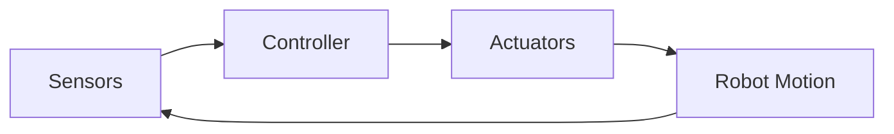

# Chapter 2: Robotics Fundamentals

## Learning Objectives

By the end of this chapter, you will understand:
- The fundamental components of robotic systems
- Kinematics and robot motion
- Control systems and feedback
- Robot programming and simulation

## 2.1 Introduction to Robotics

Robotics is the interdisciplinary field that combines engineering, computer science, and artificial intelligence to design, build, and operate robots. In Physical AI, robots serve as the physical embodiment that enables AI systems to interact with and manipulate the real world.

### 2.1.1 What is a Robot?

A robot is a programmable machine capable of carrying out a complex series of actions automatically. Key characteristics include:

1. **Programmability**: Can be instructed to perform tasks
2. **Autonomy**: Can operate without direct human control
3. **Sensing**: Can perceive its environment
4. **Actuation**: Can physically manipulate objects
5. **Intelligence**: Can make decisions based on sensory input

### 2.1.2 Classification of Robots

```python
# Robot classification system
class RobotType:
    INDUSTRIAL = "industrial"      # Manufacturing, assembly
    SERVICE = "service"            # Healthcare, domestic
    MOBILE = "mobile"             # Ground vehicles, drones
    HUMANOID = "humanoid"         # Human-like robots
    COLLABORATIVE = "collaborative" # Cobots working with humans

def classify_robot(robot):
    """Classify robot based on characteristics"""
    if robot.human_like_appearance:
        return RobotType.HUMANOID
    elif robot.works_with_humans:
        return RobotType.COLLABORATIVE
    elif robot.mobile:
        return RobotType.MOBILE
    elif robot.industrial_env:
        return RobotType.INDUSTRIAL
    else:
        return RobotType.SERVICE
```

## 2.2 Robot Components

### 2.2.1 Mechanical Structure

The mechanical structure provides the physical framework of the robot:

- **Links**: Rigid bodies that form the robot's structure
- **Joints**: Connections between links that allow relative motion
- **End-effector**: Tool or gripper at the robot's tip
- **Base**: Fixed or mobile foundation

### 2.2.2 Actuators

Actuators convert energy into mechanical motion:

```python
class Actuator:
    def __init__(self, type, max_torque, max_speed):
        self.type = type  # Electric, hydraulic, pneumatic
        self.max_torque = max_torque
        self.max_speed = max_speed
        self.current_position = 0
        self.current_speed = 0

    def move_to(self, target_position, speed=None):
        """Command actuator to move to position"""
        if speed and speed > self.max_speed:
            raise ValueError(f"Speed exceeds maximum: {self.max_speed}")

        # Implementation depends on actuator type
        print(f"Moving {self.type} actuator to {target_position}")
        self.current_position = target_position

# Example: Create servo motor for robot joint
servo = Actuator("electric", max_torque=10, max_speed=100)
servo.move_to(45, speed=50)  # Move to 45 degrees
```

### 2.2.3 Sensors

Sensors provide feedback about the robot's state and environment:

- **Internal sensors**: Joint encoders, IMUs, force sensors
- **External sensors**: Cameras, LiDAR, proximity sensors
- **Vision systems**: 2D/3D cameras, depth sensors

### 2.2.4 Controller

The controller processes sensor data and commands actuators:



## 2.3 Robot Kinematics

### 2.3.1 Forward Kinematics

Forward kinematics calculates the position of the end-effector given joint angles:

```python
import numpy as np

class RobotArm2D:
    def __init__(self, link_lengths):
        self.link_lengths = link_lengths
        self.num_joints = len(link_lengths)

    def forward_kinematics(self, joint_angles):
        """Calculate end-effector position from joint angles"""
        x = 0
        y = 0
        cumulative_angle = 0

        for i, (length, angle) in enumerate(zip(self.link_lengths, joint_angles)):
            cumulative_angle += angle
            x += length * np.cos(cumulative_angle)
            y += length * np.sin(cumulative_angle)

        return x, y

    def get_all_joint_positions(self, joint_angles):
        """Get positions of all joints including end-effector"""
        positions = [(0, 0)]
        x, y = 0, 0
        cumulative_angle = 0

        for length, angle in zip(self.link_lengths, joint_angles):
            cumulative_angle += angle
            x += length * np.cos(cumulative_angle)
            y += length * np.sin(cumulative_angle)
            positions.append((x, y))

        return positions

# Example: 2-link robot arm
arm = RobotArm2D(link_lengths=[5, 3])
angles = [np.pi/4, np.pi/6]  # 45° and 30°
end_effector = arm.forward_kinematics(angles)
print(f"End-effector position: {end_effector}")
```

### 2.3.2 Inverse Kinematics

Inverse kinematics calculates joint angles to reach a desired position:

```python
import scipy.optimize as opt

class RobotArm2D_IK(RobotArm2D):
    def inverse_kinematics(self, target_x, target_y, initial_guess=None):
        """Calculate joint angles to reach target position"""
        if initial_guess is None:
            initial_guess = [0] * self.num_joints

        def objective(joint_angles):
            x, y = self.forward_kinematics(joint_angles)
            return (x - target_x)**2 + (y - target_y)**2

        # Constrain joint angles to reasonable ranges
        bounds = [(-np.pi, np.pi) for _ in range(self.num_joints)]

        result = opt.minimize(
            objective,
            initial_guess,
            method='L-BFGS-B',
            bounds=bounds
        )

        if result.success:
            return result.x
        else:
            raise ValueError("Could not find solution for inverse kinematics")

# Example usage
arm_ik = RobotArm2D_IK(link_lengths=[5, 3])
target = (4, 4)
joint_angles = arm_ik.inverse_kinematics(target[0], target[1])
print(f"Joint angles to reach {target}: {joint_angles}")
```

## 2.4 Robot Dynamics

### 2.4.1 Newton-Euler Method

The Newton-Euler method calculates forces and torques for robot motion:

```python
class RobotDynamics:
    def __init__(self, masses, link_lengths, centers_of_mass):
        self.masses = masses
        self.link_lengths = link_lengths
        self.centers_of_mass = centers_of_mass
        self.gravity = 9.81

    def calculate_joint_torques(self, joint_angles, joint_accelerations):
        """Calculate required torques for given motion"""
        num_joints = len(joint_angles)
        torques = np.zeros(num_joints)

        for i in range(num_joints):
            # Simplified torque calculation
            # In practice, this would involve complex matrix operations

            # Gravity torque
            gravity_torque = 0
            for j in range(i, num_joints):
                # Calculate effect of gravity on each link
                distance = self.centers_of_mass[j]
                mass = self.masses[j]

                # Torque due to gravity
                angle = sum(joint_angles[i:j+1])
                gravity_torque += mass * self.gravity * distance * np.cos(angle)

            # Acceleration torque (simplified)
            accel_torque = 0
            for j in range(i, num_joints):
                # Inertia contribution
                mass = self.masses[j]
                distance = self.link_lengths[j] / 2
                accel_torque += mass * distance**2 * joint_accelerations[j]

            torques[i] = gravity_torque + accel_torque

        return torques

# Example dynamics calculation
dynamics = RobotDynamics(
    masses=[2, 1, 0.5],  # kg
    link_lengths=[1, 0.8, 0.5],  # m
    centers_of_mass=[0.5, 0.4, 0.25]  # m from joint
)

angles = [0.1, 0.2, 0.3]
accelerations = [0.5, 0.3, 0.1]
torques = dynamics.calculate_joint_torques(angles, accelerations)
print(f"Required joint torques: {torques} N⋅m")
```

## 2.5 Control Systems

### 2.5.1 PID Control

PID (Proportional-Integral-Derivative) is the most common control algorithm:

```python
import time

class PIDController:
    def __init__(self, Kp, Ki, Kd, setpoint):
        self.Kp = Kp  # Proportional gain
        self.Ki = Ki  # Integral gain
        self.Kd = Kd  # Derivative gain
        self.setpoint = setpoint

        self.last_error = 0
        self.integral_error = 0
        self.last_time = time.time()

    def update(self, current_value):
        """Calculate control output based on current value"""
        current_time = time.time()
        dt = current_time - self.last_time

        # Calculate error
        error = self.setpoint - current_value

        # Proportional term
        P = self.Kp * error

        # Integral term
        self.integral_error += error * dt
        I = self.Ki * self.integral_error

        # Derivative term
        derivative = (error - self.last_error) / dt if dt > 0 else 0
        D = self.Kd * derivative

        # Calculate total output
        output = P + I + D

        # Update state
        self.last_error = error
        self.last_time = current_time

        return output

    def reset(self):
        """Reset controller state"""
        self.last_error = 0
        self.integral_error = 0
        self.last_time = time.time()

# Example: Control robot joint position
joint_pid = PIDController(Kp=10, Ki=1, Kd=0.5, setpoint=90)
current_angle = 0

# Simulate control loop
print("Simulating joint control...")
for _ in range(20):
    control_signal = joint_pid.update(current_angle)

    # Simulate robot response (simplified)
    current_angle += control_signal * 0.1

    print(f"Current angle: {current_angle:.2f}°, Control: {control_signal:.2f}")
    time.sleep(0.1)
```

### 2.5.2 Trajectory Planning

Trajectory planning generates smooth paths for robot motion:

```python
class TrajectoryPlanner:
    @staticmethod
    def cubic_polynomial(t, t0, tf, q0, qf, qd0=0, qdf=0):
        """Generate cubic polynomial trajectory"""
        if t < t0:
            return q0, qd0
        elif t > tf:
            return qf, qdf

        # Time duration
        T = tf - t0

        # Normalized time
        s = (t - t0) / T

        # Coefficients
        a0 = q0
        a1 = qd0
        a2 = (3*(qf-q0) - (2*qd0+qdf)*T) / T**2
        a3 = (2*(q0-qf) + (qd0+qdf)*T) / T**3

        # Position and velocity
        dt = t - t0
        position = a0 + a1*dt + a2*dt**2 + a3*dt**3
        velocity = a1 + 2*a2*dt + 3*a3*dt**2

        return position, velocity

    @staticmethod
    def generate_trajectory(waypoints, duration=1.0):
        """Generate trajectory through multiple waypoints"""
        trajectory = []

        for i in range(len(waypoints) - 1):
            t0 = i * duration
            tf = (i + 1) * duration
            q0 = waypoints[i]
            qf = waypoints[i + 1]

            # Sample trajectory segment
            for j in range(100):
                t = t0 + (j / 100) * duration
                pos, vel = TrajectoryPlanner.cubic_polynomial(t, t0, tf, q0, qf)
                trajectory.append({'time': t, 'position': pos, 'velocity': vel})

        return trajectory

# Example: Generate trajectory for robot arm
waypoints = [0, 45, 90, 45, 0]  # degrees
trajectory = TrajectoryPlanner.generate_trajectory(waypoints, duration=2.0)

print("Sample trajectory points:")
for i, point in enumerate(trajectory[::100]):  # Print every 100th point
    print(f"t={point['time']:.2f}s: pos={point['position']:.1f}°, vel={point['velocity']:.1f}°/s")
```

## Key Takeaways

1. Robotics combines mechanical, electrical, and computational systems
2. Kinematics describes robot motion without considering forces
3. Dynamics analyzes forces and torques required for motion
4. Control systems enable precise robot motion
5. PID control is fundamental to robot actuation

## Practice Exercises

1. Implement forward kinematics for a 3-DOF planar robot
2. Design a PID controller for a simulated robot joint
3. Create a trajectory planner for smooth robot motion
4. Analyze the dynamic requirements for a given robot task

## Next Chapter

In Chapter 3, we'll explore Computer Vision for Physical AI, including image processing, object detection, and visual servoing techniques that enable robots to see and understand their environment.